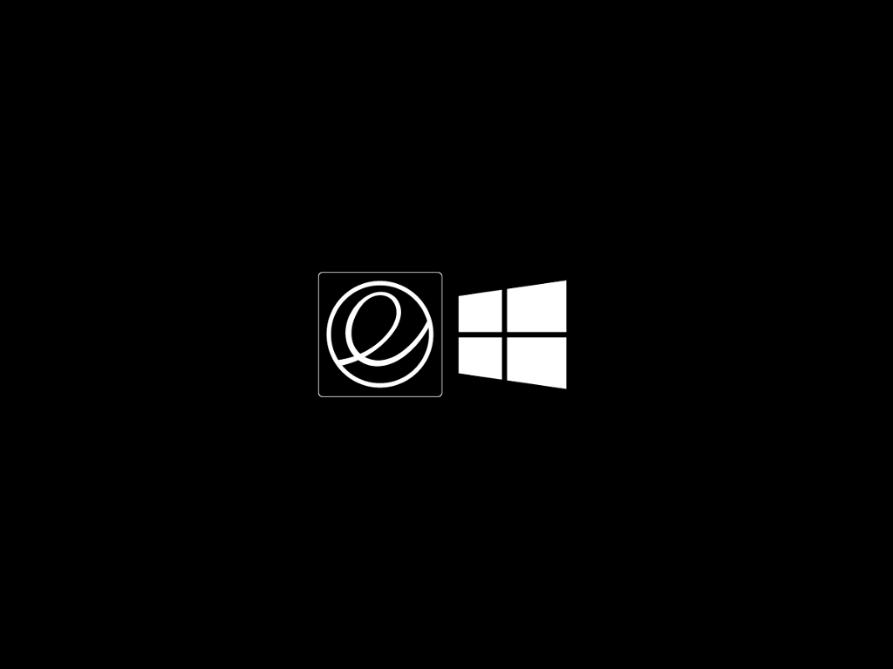

## rEFInd Black theme

[rEFInd](http://www.rodsbooks.com/refind/) is a simplistic boot manager for UEFI based systems. 

### Inspirations

This is a clean and minimal theme inspired from the [rEFInd-minimal](http://evanpurkhiser.com/rEFInd-minimal/) theme by [Evan Purkhiser](https://github.com/EvanPurkhiser) and the screenshot from [Avi Romanoff](https://github.com/aroman)'s [freya-on-a-mac](https://github.com/aroman/freya-on-a-mac) project.



### Usage

1. Clone the repository to your computer

`git clone https://github.com/st-andrew/rEFInd-Black.git`

2. Copy the refind-black folder (the one inside the project) into the same directory as your rEFInd efi executable (usually `/boot/EFI/refind/`).

3. Open the `refind.conf` file and add the line

`include refind-black/refind-black.conf`

### Customization

Follow the [rEFInd guides](http://www.rodsbooks.com/refind/) to customize the refind-black config file to suit your needs.

To set the icons for your entries you will want to add the `icon` option to each menuentry which points to the icon under `refind-black/icons` that you would like to use for that entry.

Here's an example configuration (from the screenshot)

````
# showtools               shutdown

scan_all_linux_kernels  false

scanfor                 manual,external

resolution 0

hideui singleuser,hints,arrows,label

icons_dir refind-black/icons

banner refind-black/background.png

selection_big   refind-black/selection-big.png
selection_small refind-black/selection-small.png

menuentry Elementary {
    loader EFI/Elementary/vmlinuz-3.16.1
    initrd EFI/Elementary/initrd.img-3.16.1
    options "root=/dev/sda2 rw"
}

menuentry Windows {
    icon EFI/refind/refind-black/icons/os_win.png
    loader EFI/Microsoft/Boot/bootmgfw.efi
}
````

To show the shutdown option while booting, uncomment the `#showtools shutdown` line in the `refind-black.conf` file.

Entries that are autodetected should also show the proper icons.

Note that this theme currently only has icons for Elementary OS and Windows 8.

